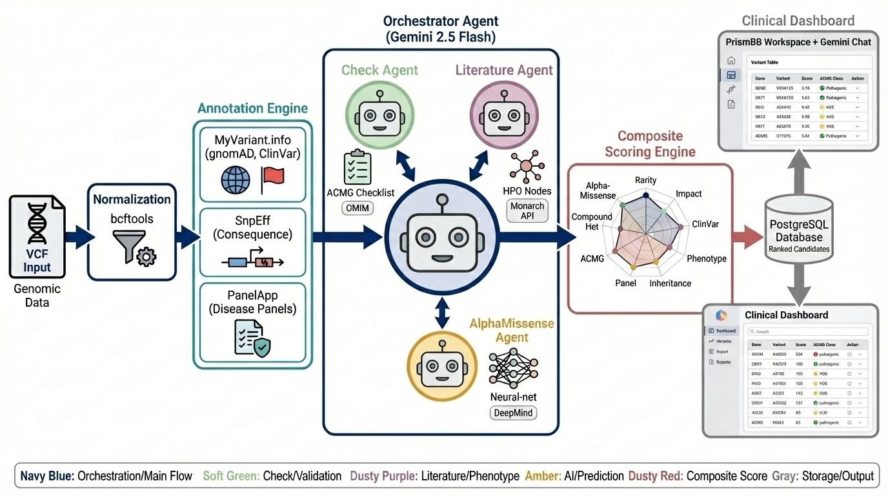

# PrismBB — VCF Interpretation Agent

> A clinical-grade, multi-agent genomics platform that interprets whole-exome sequencing VCF files using AI-powered agents, ACMG classification, and composite variant prioritisation.



---

## Overview

PrismBB takes a raw VCF file as input and delivers a ranked, annotated, and clinically interpreted candidate variant list. A multi-stage bioinformatics pipeline combined with a multi-agent AI system (Google Gemini 2.5 Flash) automates evidence gathering, ACMG rule evaluation, phenotype matching, and AI pathogenicity scoring — all surfaced through a clean clinical web workspace.

---

## Architecture

```
VCF Input
    │
    ▼
Normalization (bcftools)
    │
    ▼
Annotation Engine
  ├── MyVariant.info  (gnomAD · ClinVar · AlphaMissense)
  ├── SnpEff          (consequence · HGVS · impact)
  └── PanelApp        (disease gene panels)
    │
    ▼
┌─────────────────────────────────────────────┐
│           Orchestrator Agent                │
│           (Gemini 2.5 Flash)                │
│   ┌──────────────┬──────────────────────┐   │
│   │ Check Agent  │  Literature Agent    │   │
│   │ ACMG + OMIM  │  HPO + Monarch API   │   │
│   └──────────────┴──────────────────────┘   │
│         AlphaMissense Agent (DeepMind)       │
└─────────────────────────────────────────────┘
    │
    ▼
Composite Scoring Engine  (9-factor weighted score)
    │
    ▼
PostgreSQL  →  PrismBB Clinical Dashboard
```

---

## Agents

| Agent | Role |
|---|---|
| **Orchestrator Agent** | Central coordinator (Gemini 2.5 Flash). Drives the entire pipeline, delegates to sub-agents, and powers the Gemini Chat interface for natural language Q&A |
| **Check Agent** | Validates ACMG rules (PVS1, PM2, PP3, BA1, BS1, BP4) against OMIM disease entries. Returns `confirmed`, `conflict`, `unconfirmed`, or `no_omim_entry` per variant |
| **Literature Agent** | HPO phenotype semantic similarity matching via the Monarch Initiative API — produces ranked disease candidate scores |
| **AlphaMissense Agent** | Integrates DeepMind's AlphaMissense deep-learning pathogenicity predictions via MyVariant.info |

---

## Composite Scoring (9 Factors)

| Factor | Weight |
|---|---|
| Rarity (gnomAD AF) | 25% |
| Functional Impact (HIGH / MODERATE / LOW) | 25% |
| ClinVar Significance | 20% |
| Phenotype Match (HPO / Monarch) | 15% |
| Inheritance & Zygosity | 10% |
| PanelApp Gene Panel Membership | 5% |
| ACMG Classification Bonus | +modifier |
| Compound Heterozygosity Bonus | +modifier |
| AlphaMissense Score | +modifier |

---

## Tech Stack

| Layer | Technology |
|---|---|
| **Frontend** | Next.js 14, React, TypeScript, Tailwind CSS |
| **Backend** | FastAPI, Python 3.11, SQLAlchemy (async), Alembic |
| **Database** | PostgreSQL 15 |
| **AI Agents** | Google Gemini 2.5 Flash (function calling) |
| **Pipeline** | bcftools, SnpEff, MyVariant.info, PanelApp, Monarch API |
| **Infra** | Docker, Docker Compose |

---

## Quick Start

### Docker (recommended)

```bash
git clone https://github.com/Babajan-B/PrismBB-Genomics.git
cd PrismBB-Genomics

cp .env.example .env
cp backend/.env.example backend/.env
# Edit both .env files — add your GEMINI_API_KEY

docker-compose up
```

| Service | URL |
|---|---|
| Frontend | http://localhost:3000 |
| Backend API | http://localhost:8000 |
| Swagger Docs | http://localhost:8000/docs |

---

### Local Development

**Backend**
```bash
cd backend
python -m venv .venv && source .venv/bin/activate
pip install -r requirements.txt
cp .env.example .env   # add GEMINI_API_KEY
uvicorn app.main:app --reload
```

**Frontend**
```bash
cd frontend
npm install
npm run dev
```

---

## Environment Variables

| Variable | Required | Description |
|---|---|---|
| `GEMINI_API_KEY` | ✅ | Google Gemini API key |
| `GEMINI_MODEL` | ✅ | Model name (e.g. `gemini-2.5-flash`) |
| `DATABASE_URL` | ✅ | PostgreSQL async connection string |
| `VEP_MODE` | — | `rest` (default) or `local` |
| `BCFTOOLS_PATH` | — | Path to bcftools binary (auto-detected) |
| `UPLOAD_DIR` | — | Directory for VCF uploads |
| `NCBI_API_KEY` | — | Increases PubMed rate limit |

See `.env.example` and `backend/.env.example` for full templates.

---

## API Reference

| Method | Endpoint | Description |
|---|---|---|
| `POST` | `/api/upload` | Upload VCF and start pipeline |
| `GET` | `/api/jobs/{id}/status` | Poll job progress |
| `GET` | `/api/jobs/{id}/variants` | Ranked candidate variant list |
| `GET` | `/api/jobs/{id}/variants/{vid}` | Full single variant evidence card |
| `POST` | `/api/chat` | Gemini Agent Q&A |
| `GET` | `/api/jobs/{id}/report?format=csv` | Export report (CSV / Excel / JSON) |
| `GET` | `/api/jobs/{id}/audit` | Deterministic pipeline audit trail |

---

## Clinical Workspace

Each uploaded VCF gets its own job workspace:

- **Overview** — pipeline progress, QC metrics, sample info
- **Variant Explorer** — filterable ranked table (gene, location, ACMG, ClinVar, gnomAD, score)
- **Priority Ranking** — top candidates with per-factor score breakdown and reasoning
- **Gemini Chat** — natural language Q&A grounded in variant evidence via the Orchestrator Agent
- **Export Reports** — CSV, Excel, and full JSON downloads
- **Audit Trail** — step-by-step deterministic pipeline log

---

## License

[MIT](LICENSE) © 2026 Babajan B
